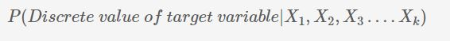

# Logistic Regression

**Logistic regression**, which is a **classification model**, i.e. it will help you make predictions in cases where the output is a **categorical variable**. Since logistic regression is the most easily interpretable of all classification models, it is very commonly used in various industries such as banking, healthcare, etc.

## Introduction: Univariate Logistic Regression
In this session, you will learn a few basic concepts related to logistic regression. Broadly speaking, the topics that will be covered in this session are:

* Binary classification
* Sigmoid function
* Likelihood function
* Building a logistic regression model in Python
* Odds and log odds

## Binary Classification
The most common use of logistic regression models is in binary classification problems.

#### Examples of Classification
1. Finance company wants to know whether a customer is default or not.
2. Predicting an email is spam or not.
3. Categorizing email into promotional, personal and official.

A classification problem where we have two possible outputs/outcomes is called as **Binary Classification problem.**
* Examples
    1. Customer default or not.
    2. Spam/ham example.
    3. Categorizing email into promotional, personal and official. This is not a binary classification problem but a multi class classification problem.

[Diabetes Data](dataset/DiabetesExampleData.csv)

Now, recall the graph of the diabetes example. Suppose there is another person, with a blood sugar level of 195, and you do not know whether that person has diabetes or not. What would you do then? Would you classify him/her as a diabetic or as a non-diabetic?

Now, based on the boundary, you may be tempted to declare this person a diabetic, but can you really do that? This person’s sugar level (195 mg/dL) is very close to the threshold (200 mg/dL), below which people are declared as non-diabetic. It is, therefore, quite possible that this person was just a non-diabetic with a slightly high blood sugar level. After all, the data does have people with slightly high sugar levels (220 mg/dL), who are not diabetics.

## Sigmoid Curve
In the last section, you saw what a binary classification problem is, and then you saw an example of a binary classification problem, where a model is trying to predict whether a person has diabetes or not based on his/her blood sugar level. We saw how using a **simple boundary decision method** would not work in this case.

Since the **sigmoid curve** has all the properties you would want — extremely low values in the start, extremely high values in the end, and intermediate values in the middle — it’s a good choice for modelling the value of the **probability of diabetes.**

This is the sigmoid curve equation:

So now we have verified, with actual values, that the sigmoid curve actually has the properties we discussed earlier, i.e. extremely low values in the start, extremely high values in the end, and intermediate values in the middle.

However, you may be wondering — why can’t you just fit a straight line here? This would also have the same properties — low values in the start, high ones towards the end, and intermediate ones in the middle.

The main problem with a straight line is that it is not steep enough. In the sigmoid curve, as you can see, you have low values for a lot of points, then the values rise all of a sudden, after which you have a lot of high values. In a straight line though, the values rise from low to high very uniformly, and hence, the “boundary” region, the one where the probabilities transition from high to low is not present.

## Finding the Best Fit Sigmoid Curve - I

So, in the previous lecture, you saw what a sigmoid function is and why it is a good choice for modelling the probability of a class. Now, in this section, you will learn how you can find the best fit sigmoid curve. In other words, you will learn how to find the combination of β0 and β1 which fits the data best.

By varying the values of β0 and β1, we get different sigmoid curves. Now, based on some function that you have to minimise or maximise, you will get the best fit sigmoid curve.

So, the best fitting combination of β0 and β1 will be the one which maximises the product:

## Finding the Best Fit Sigmoid Curve - II
In the previous lecture, you understood what a likelihood function is. To recap, the likelihood function for our data is **(1-P1)(1-P2)(1-P3)(1-P4)(1-P6)(P5)(P7)(P8)(P9)(P10) .** The best fitting sigmoid curve would be the one which maximises the value of this product.

If you had to find β0 and β1 for the best fitting sigmoid curve, you would have to try a lot of combinations, unless you arrive at the one which maximises the likelihood. This is similar to linear regression, where you vary β0 and β1 until you find the combination that minimises the cost function. 
This process, where you vary the betas until you find the best fit curve for the probability of diabetes, is called **logistic regression.**

## Odds and Log Odds
In the previous segment, you saw that by trying different values of β0 and β1 , you can manipulate the shape of the sigmoid curve. At some combination of β0 and β1, the 'likelihood' will be maximised.

###  Logistic Regression in Python
Let's now look at how logistic regression is implemented in python.In python, logistic regression can be implemented using libraries such as SKLearn and statsmodels, though looking at the coefficients and the model summary is easier using statsmodels. 

You can find the optimum values of β0 and β1 using the python code given below. Please download and run the code and observe the values of the coefficients.

Please note that you will study a detailed Python code for logistic regression in the next module. This Python code has been run so as to find the optimum values of β0 and β1 so that we can first proceed with the very important concept of **Odds and Log Odds**.

[Finding Optimum Betas using Python](dataset/Betas+for+Logistic+Regression.ipynb)

The summary of the model is given below:

In the summary shown above, 'const' corresponds to β0 and Blood Sugar Level, i.e. 'x1' corresponds to β1. So, β0 = -13.5 and β1 = 0.06.

### Odds and Log Odds
So far, you’ve seen this equation for logistic regression:

Recall that this equation gives the relationship between P, the probability of diabetes and x, the patient’s blood sugar level.

While the equation is correct, it is not very intuitive. In other words, the relationship between P and x is so complex that it is difficult to understand what kind of trend exists between the two. If you increase x by regular intervals of, say, 11.5, how will that affect the probability? Will it also increase by some regular interval? If not, what will happen?

So, clearly, the relationship between P and x is too complex to see any apparent trends. However, if you convert the equation to a slightly different form, you can achieve a much more intuitive relationship. 

[Note: By default, for this course, if the base of the logarithm is not specified, take it as e. So, log(x) = loge(x)]

So, now, instead of probability, you have odds and log odds. Clearly, the relationship between them and x is much more intuitive and easy to understand.

So, the relationship between x and probability is not intuitive, while that between x and **odds/log odds** is. This has important implications. Suppose you are discussing sugar levels and the probability they correspond to. While talking about 4 patients with sugar levels of 180, 200, 220 and 240, you will not be able to intuitively understand the relationship between their probabilities (10%, 28%, 58%, 83%). However, if you are talking about the log odds of these 4 patients, you know that their log odds are in a **linearly increasing pattern** (-2.18, -0.92, 0.34, 1.60) and that the odds are in a **multiplicatively increasing pattern** (0.11, 0.40, 1.40, 4.95, increasing by a factor of 3.55).

Hence, many times, it makes more sense to present a logistic regression model’s results in terms of log odds or odds than to talk in terms of probability. This happens especially a lot in industries like finance, banking, etc.

That's the end of this session on univariate logistic regression. You studied logistic regression, specifically, the sigmoid function, which has this equation:

However, this is not the only form of equation for logistic regression. There is also the probit form and cloglog form of logistic regression.

## Multivariate Logistic Regression - Model Building

### Introduction
Just like when you’re building a model using linear regression, one independent variable might not be enough to capture all the uncertainties of the target variable in logistic regression as well. So in order to make good and accurate predictions, you need multiple variables and that is what we’ll study in this session.

Before starting with multivariate logistic regression, the first question that arises is, “Do you need any extensions while moving from univariate to multivariate logistic regression?” Recall the equation used in the case of univariate logistic regression was:

The above equation has only one feature variable X, for which the coefficient is β1. Now, if you have multiple features, say n, you can simply extend this equation with ‘n’ feature variables and ‘n’ corresponding coefficients such that the equation now becomes:

Recall this extension is similar to what you did while moving from simple to multiple linear regression.

## Multivariate Logistic Regression - Telecom Churn Example
Let's now look at the process of building a logistic regression model in Python.

You will be looking at the telecom churn prediction example. You will use 21 variables related to customer behaviour (such as the monthly bill, internet usage etc.) to predict whether a particular customer will switch to another telecom provider or not (i.e. churn or not).

#### Problem Statment
You have a telecom firm which has collected data of all its customers. The main types of attributes are:
* Demographics (age, gender etc.)
* Services availed (internet packs purchased, special offers taken etc.)
* Expenses (amount of recharge done per month etc.)

Based on all this past information, you want to build a model which will predict whether a particular customer will churn or not, i.e. whether they will switch to a different service provider or not. So the variable of interest, i.e. the target variable here is ‘Churn’ which will tell us whether or not a particular customer has churned. It is a binary variable - 1 means that the customer has churned and 0 means the customer has not churned.

You can download the datasets here:

[Churn Data](dataset/churn_data.csv)

[Internet Data](dataset/internet_data.csv)

[Customer Data](dataset/customer_data.csv)

Also, here’s the data dictionary:

[Telecom Churn Data Dictionary](dataset/TelecomChurnDataDictionary.csv)

You can also download the code file and may follow along. 

[Logistic Regression Telecom Churn Case Study](dataset/Logistic+Regression+-+Telecom+Churn+Case+Study.ipynb)

So, here’s what the data frame churn_data looks like:

Also, here’s the data frame customer_data:

Lastly, here’s the data frame internet_data:

Now, as you can clearly see, the first 5 customer IDs are exactly the same for each of these data frames. Hence, using the column customer ID, you can collate or merge the data into a single data frame. We'll start with that in the next segment.

## Data Cleaning and Preparation - I
Before you jump into the actual model building, you first need to clean and prepare your data. As you might have seen in the last segment, all the useful information is present in three dataframes with ‘Customer ID’ being the common column. So as the first step, you need to merge these three data files so that you have all the useful data combined into a single master dataframe. 

Now that you have the master dataframe in place, and you have also performed a binary mapping for few of the categorical variables, the next step would be to create dummy variables for features with multiple levels. The dummy variable creation process is similar to what you did in linear regression as well. 

So the process of dummy variable creation was quite familiar, except this time, you manually dropped one of the columns for many dummy variables. For example, for the column ‘MultipleLines’, you dropped the level ‘MultipleLines_No phone service’ manually instead of simply using ‘drop_first = True’ which would’ve dropped the first level present in the ‘MultipleLines’ column. The reason we did this is that if you check the variables ‘MultipleLines’ using the following command, you can see that it has the following three levels:

Now, out of these levels, it is best that you drop ‘No phone service’ since it isn’t of any use because it is anyway being indicated by the variable ‘PhoneService’ already present in the dataframe.

To simply put it, the variable **‘PhoneService’** already tells you whether the phone services are availed or not by a particular customer. In fact, if you check the value counts of the variable 'PhoneService', following is the output that you get:

You can see that the dummy variable for this level, i.e. 'MultipleLines_No phone service' is clearly redundant since it doesn't contain any extra information and hence, to drop it is the best option at this point. You can verify it similarly for all the other categorical variables for which one of the levels was manually dropped.

### Data Cleaning and Preparation - II
You’ve merged your dataframes and handled the categorical variables present in them. But you still need to check the data for any outliers or missing values and treat them accordingly. Let's get this done as well.

You saw that one of the columns, i.e. 'TotalCharges' had 11 missing values. Since this isn't a big number compared to the number of rows present in a dataset, we decided to drop them since we won't lose much data.

Now that you have completely prepared your data, you can start with the preprocessing steps. As you might remember from the previous module, you first need to split the data into train and test sets and then rescale the features. So let’s start with that.

We scaled the variables to standardise the three continuous variables — tenure, monthly charges and total charges. Recall that scaling basically reduces the values in a column to within a certain range — in this case, we have converted the values to the Z-scores.

### Churn Rate and Class Imbalance

Another thing to note here was the Churn Rate. You saw that the data has almost 27% churn rate. Checking the churn rate is important since you usually want your data to have a balance between the 0s and 1s (in this case churn and not-churn). 

The reason for having a balance is simple. Let’s do a simple thought experiment - if you had a data with, say, 95% not-churn (0) and just 5% churn (1), then even if you predict everything as 0, you would still get a model which is 95% accurate (though it is, of course, a bad model). This problem is called **class-imbalance** and you'll learn to solve such cases later.

Fortunately, in this case, we have about 27% churn rate. This is neither exactly 'balanced' (which a 50-50 ratio would be called) nor heavily imbalanced. So we'll not have to do any special treatment for this dataset.

## Building your First Model
Let’s now proceed to model building. Recall that the first step in model building is to check the correlations between features to get an idea about how the different independent variables are correlated. In general, the process of feature selection is almost exactly analogous to linear regression.

Looking at the correlations certainly did help, as you identified a lot of features beforehand which wouldn’t have been useful for model building. We can drop the following features after looking at the correlations from the heatmap:
* MultipleLines_No
* OnlineSecurity_No
* OnlineBackup_No
* DeviceProtection_No
* TechSupport_No
* StreamingTV_No
* StreamingMovies_No

If you look at the correlations between these dummy variables with their complimentary dummy variables, i.e. ‘MultipleLines_No’ with ‘MultipleLines_Yes’ or ‘OnlineSecurity_No’ with ‘OnlineSecurity_Yes’, you’ll find out they’re highly correlated. Have a look at the heat map below:

If you check the highlighted portion, you’ll see that there are high correlations among the pairs of dummy variables which were created for the same column. For example, **‘StreamingTV_No’** has a correlation of **-0.64** with **‘StreamingTV_Yes’**. So it is better than we drop one of these variables from each pair as they won’t add much value to the model. The choice of which of these pair of variables you desire to drop is completely up to you; we’ve chosen to drop all the 'Nos' because the 'Yeses' are generally more interpretable and easy-to-work-with variables.

Now that you have completed all the pre-processing steps, inspected the correlation values and have eliminated a few variables, it’s time to build our first model. 

So you finally built your first multivariate logistic regression model using all the features present in the dataset. This is the summary output for different variables that you got:

In this table, our key focus area is just the different **coefficients** and their respective **p-values**. As you can see, there are many variables whose p-values are high, implying that that variable is statistically insignificant. So we need to eliminate some of the variables in order to build a better model.

We'll first eliminate a few features using Recursive Feature Elimination (RFE), and once we have reached a small set of variables to work with, we can then use manual feature elimination (i.e. manually eliminating features based on observing the p-values and VIFs).

### Feature Elimination using RFE
You built your first model in the previous segment. Based on the summary statistics, you inferred that many of the variables might be insignificant and hence, you need to do some feature elimination. Since the number of features is huge, let's first start off with an automated feature selection technique (RFE) and then move to manual feature elimination (using p-values and VIFs) - this is exactly the same process that you did in linear regression.

So let's start off with the automatic feature selection technique - RFE.

Let's see the steps you just performed one by one. First, you imported the logistic regression library from sklearn and created a logistic regression object using:

Then you run an RFE on the dataset using the same command as you did in linear regression. In this case, we choose to select 15 features first (15 is, of course, an arbitrary number).

RFE selected 15 features for you and following is the output you got:

You can see that RFE has eliminated certain features such as 'MonthlyCharges', 'Partner', 'Dependents', etc.    

We decided to go ahead with this model but since we are also interested in the statistics, we take the columns selected by RFE and use them to build a model using statsmodels using:

Here, you use the **GLM (Generalized Linear Models)** method of the library statsmodels. **'Binomial()'** in the 'family' argument tells statsmodels that it needs to fit **a logit curve to a binomial data** (i.e. in which the target will have just two classes, here 'Churn' and 'Non-Churn').

Now, recall that the logistic regression curve gives you the **probabilities of churning and not churning**. You can get these probabilities by simply using the **'predict'** function as shown in the notebook.

Since the logistic curve gives you just the probabilities and not the actual classification of **'Churn'** and **'Non-Churn'**, you need to find a **threshold probability** to classify customers as 'churn' and 'non-churn'. Here, we choose 0.5 as an arbitrary cutoff wherein if the probability of a particular customer churning is less than 0.5, you'd classify it as **'Non-Churn'** and if it's greater than 0.5, you'd classify it as **'Churn'. The choice of 0.5 is completely arbitrary at this stage** and you'll learn how to find the optimal cutoff in 'Model Evaluation', but for now, we'll move forward with 0.5 as the cutoff.

### Confusion Matrix and Accuracy
You chose a cutoff of 0.5 in order to classify the customers into 'Churn' and 'Non-Churn'. Now, since you're classifying the customers into two classes, you'll obviously have some errors. The classes of errors that would be there are:
* 'Churn' customers being (incorrectly) classified as 'Non-Churn'
* 'Non-Churn' customers being (incorrectly) classified as 'Churn'

To capture these errors, and to evaluate how well the model is, you'll use something known as the **'Confusion Matrix'**. A typical confusion matrix would look like the following:

This table shows a comparison of the predicted and actual labels. The actual labels are along the vertical axis, while the predicted labels are along the horizontal axis. Thus, the second row and first column (263) is the number of customers who have actually ‘churned’ but the model has predicted them as non-churn.

Similarly, the cell at second row, the second column (298) is the number of customers who are actually ‘churn’ and also predicted as ‘churn’.

Note that this is an example table and not what you'll get in Python for the model you've built so far. It is just used an example to illustrate the concept.

Now, the simplest model evaluation metric for classification models is accuracy - it is the percentage of correctly predicted labels. So what would the correctly predicted labels be? They would be:
* 'Churn' customers being actually identified as churn
* 'Non-churn' customers being actually identified as non-churn.

As you can see from the table above, the correctly predicted labels are contained in the first row and first column, and the last row and last column as can be seen highlighted in the table below:

Now, accuracy is defined as:

Hence, using the table, we can say that the accuracy for this table would be:

Now that you know about confusion matrix and accuracy, let's see how good is your model built so far based on the accuracy. 

So using the confusion matrix, you got an accuracy of about 80.8% which seems to be a good number to begin with. The steps you need to calculate accuracy are:
* Create the confusion matrix
* Calculate the accuracy by applying the 'accuracy_score' function to the above matrix

### Manual Feature Elimination

Recall that you had used RFE to select 15 features. But as you saw in the pairwise correlations, there are high values of correlations present between the 15 features, i.e. there is still some multicollinearity among the features. So you definitely need to check the VIFs as well to further eliminate the redundant variables. Recall that VIF  calculates how well one independent variable is explained by all the other independent variables combined. And its formula is given as:

where 'i' refers to the ith variable which is being represented as a combination of rest of the independent variables.

To summarise, you basically performed an iterative manual feature elimination using the VIFs and p-values repeatedly. You also kept on checking the value of accuracy to make sure that dropping a particular feature doesn't affect the accuracy much. 

This was the set of 15 features that RFE had selected which we began with:

And this is the final set of features which you arrived at after eliminating features manually:

As you can see, we had dropped the features 'PhoneService' and 'TotalCharges' as a part of manual feature elimination.
Now that we have a final model, we can begin with model evaluation and making predictions.

## Multivariate Logistic Regression - Model Evaluation
In this session, you will first learn about a few more metrics beyond accuracy that are essential to evaluate the performance of a logistic regression model. Then based on these metrics, you'll learn how to find out the optimal scenario where the model will perform the best. The metrics that you'll learn about are:
* Accuracy
* Sensitivity, specificity and the ROC curve
* Precision and Recall
Finally, once you've chosen the optimal scenario based on the evaluation metrics, we'll finally go on and make predictions on the test dataset and see how your model performs there as well.

### Metrics Beyond Accuracy: Sensitivity & Specificity
In the previous session, you built a logistic regression model and arrived at the final set of features using RFE and manual feature elimination. You got an accuracy of about **80.475%** for the model. But the question now is - Is accuracy enough to assess the goodness of the model? As you'll see, the answer is a big **NO!** 

To understand why accuracy is often not the best metric, consider this business problem -

"Let’s say that increasing ‘churn’ is the most serious issue in the telecom company, and the company desperately wants to retain customers. To do that, the marketing head decides to roll out dffers to all customeiscounts and ors who are likely to churn - ideally, not a single ‘churn’ customer should be missed. Hence, it is important that the model identifies almost all the ‘churn’ customers correctly. It is fine if it incorrectly predicts some of the ‘non-churn’ customers as ‘churn’ since in that case, the worst that will happen is that the company will offer discounts to those customers who would anyway stay."

Let's take a look at the confusion matrix we got for our final model again - the actual labels are along the column while the predicted labels are along the rows (for e.g. 595 customers are actually 'churn' but predicted as 'not-churn'):

From the table above, you can see that there are **595 + 692  = 1287** actual ‘churn’ customers, so ideally the model should predict all of them as ‘churn’ (i.e. corresponding to the business problem above). But out of these 1287, the current model only predicts 692 as ‘churn’. Thus, only 692 out of 1287, or **only about 53% of ‘churn’ customers, will be predicted by the model as ‘churn’**. This is very risky - the company won’t be able to roll out offers to the rest 47% ‘churn’ customers and they could switch to a competitor!

So although the accuracy is about 80%, the model only predicts 53% of churn cases correctly.

In essence, what’s happening here is that you care more about one class (class='churn') than the other. This is a very common situation in classification problems - you almost always care more about one class than the other. On the other hand, the accuracy tells you model's performance on both classes combined - which is fine, but not the most important metric.

Consider another example - suppose you're building a logistic regression model for cancer patients. Based on certain features, you need to predict whether the patient has cancer or not. In this case, if you incorrectly predict many diseased patients as 'Not having cancer', it can be very risky. In such cases, it is better that instead of looking at the overall accuracy, you care about predicting the 1's (the diseased) correctly. 

Similarly, if you're building a model to determine whether you should block (where blocking is a 1 and not blocking is a 0) a customer's transactions or not based on his past transaction behaviour in order to identify frauds, you'd care more about getting the 0's right. This is because you might not want to wrongly block a good customer's transactions as it might lead to a very bad customer experience. 

Hence, it is very crucial that you consider the **overall business problem** you are trying to solve to decide the metric you want to maximise or minimise.

This brings us to two of the most commonly used metrics to evaluate a classification model:
1. Sensitivity
2. Specificity
Let's understand these metrics one by one. **Sensitivity** is defined as:

Here, 'yes' means 'churn' and 'no' means 'non-churn'. Let's look at the confusion matrix again.

The different elements in this matrix can be labelled as follows:

* The first cell contains the actual 'Not Churns' being predicted as 'Not-Churn' and hence, is labelled **'True Negatives'** (Negative implying that the class is '0', here, Not-Churn.).
* The second cell contains the actual 'Not Churns' being predicted as 'Churn' and hence, is labelled **'False Positive'** (because it is predicted as 'Churn' (Positive) but in actuality, it's not a Churn).
* Similarly, the third cell contains the actual 'Churns' being predicted as 'Not Churn' which is why we call it **'False Negative'**.
* And finally, the fourth cell contains the actual 'Churns' being predicted as 'Churn' and so, it's labelled as **'True Positives'**.

Now, to find out the sensitivity, you first need the number of actual Yeses correctly predicted. This number can be found at in the last row, last column of the matrix (which is denoted as true positives). This number if **692**. Now, you need the total number of actual Yeses. This number will be the sum of the numbers present in the last row, i.e. the actual number of churns (this will include the actual churns being wrongly identified as not-churns, and the actual churns being correctly identified as churns). Hence, you get **(595 + 692) = 1287**. 

Now, when you replace these values in the sensitivity formula, you get:

Thus, you can clearly see that although you had a high accuracy **(~80.475%)**, your sensitivity turned out to be quite low **(~53.768%)**

Now, similarly, specificity is defined as:

As you can now infer, this value will be given by the value **True Negatives (3269)** divided by the actual number of negatives, i.e. **True Negatives + False Positives (3269 + 366 = 3635)**. Hence, by replacing these values in the formula, you get specificity as:   

### Sensitivity & Specificity in Python

In the last segment, you learnt the importance of having evaluation metrics other than accuracy. Thus, you were introduced to two new metrics - **sensitivity and specificity**. You learnt the theory of sensitivity and specificity and how to calculate them using a confusion matrix. Now, let's learn how to calculate these metrics in Python as well.

You can access the different elements in the matrix using the following indexing - 

And now, let's rewrite the formulas of sensitivity and specificity using the labels of the confusion matrix.

So your model seems to have **high accuracy (~80.475%)** and **high specificity (~89.931%)**, but **low sensitivity (~53.768%)** and since you're interested in identifying the customers which might churn, you clearly need to deal with this.

## ROC Curve (Receiver operating characteristic Curve)
So far you have learned about some evaluation metrics and saw why they're important to evaluate a logistic regression model. Now, recall that the sensitivity that you got **(~53.768%)** was quite low and clearly needs to be dealt with. But what was the cause of such a low sensitivity in the first place?

If you remember, when you assigned 0s and 1s to the customers after building the model, you arbitrarily chose a cut-off of 0.5 wherein if the probability of churning for a customer is greater than **0.5**, you classified it as a 'Churn' and if the probability of churning for a customer is less than 0.5, you classified it as a 'Non-churn'. 

Now, this cut-off was chosen at random and there was no particular logic behind it. So it might not be the ideal cut-off point for classification which is why we might be getting such a low sensitivity. So how do you find the ideal cutoff point? For a more intuitive understanding, this part has been demonstrated in Excel. You can download the excel file from below.

[ROC Curve - Excel Demo](dataset/ROC+Curve+-+Excel+Demo.xlsx)

So you saw that the predicted labels depend entirely on the cutoff or the threshold that you have chosen. For low values of threshold, you'd have a higher number of customers predicted as a 1 (Churn). This is because if the threshold is low, it basically means that everything above that threshold would be one and everything below that threshold would be zero. So naturally, a lower cutoff would mean a higher number of customers being identified as 'Churn'. Similarly, for high values of threshold, you'd have a higher number of customer predicted as a 0 (Not-Churn) and a lower number of customers predicted as a 1 (Churn).

Now, let's move forward with our discussion on how to choose an optimal threshold point. For that, you'd first need a few basic terminologies (some of which you have seen in earlier sections.)

So you learned about the following two terminologies -

### True Positive Rate (TPR)
This value gives you the number of positives correctly predicted divided by the total number of positives. Its formula as shown in the video is:

Now, recall the labels in the confusion matrix,

As you can see, the highlighted portion shows the row containing the total number of actual positives. Therefore, the denominator term, i.e. in the formula for TPR is nothing but -

As you might remember, the above formula is nothing but the formula for **sensitivity**. Hence, the term True Positive Rate that you just learnt about is nothing but sensitivity.

The second term which you saw was -

### False Positive Rate (FPR)
This term gives you the number of false positives (0s predicted as 1s) divided by the total number of negatives. The formula was -

Again, if you recall the formula for specificity, it is given by - 

Hence, you can see that the formula for False Positive Rate (FPR) is nothing but **(1 - Specificity)**. You can easily verify it yourself.

So, now that you have understood what these terms are, you'll now learn about **ROC Curves** which show the **tradeoff between the True Positive Rate (TPR) and the False Positive Rate (FPR)**. And as was established from the formulas above, TPR and FPR are nothing but sensitivity and (1 - specificity), so it can also be looked at as a tradeoff between sensitivity and specificity. 

So you can clearly see that there is **a tradeoff between the True Positive Rate and the False Positive Rate, or simply, a tradeoff between sensitivity and specificity.** When you plot the true positive rate against the false positive rate, you get a graph which shows the trade-off between them and this curve is known as the ROC curve. The following image shows the ROC curve that you plotted in Excel.

As you can see, for higher values of TPR, you will also have higher values of FPR, which might not be good. So it's all about finding a balance between these two metrics and that's what the ROC curve helps you find. You also learnt that a good ROC curve is the one which touches the upper-left corner of the graph; so higher the area under the curve of an ROC curve, the better is your model.

## ROC Curve in Python
Now that you have learnt the theory of ROC curve, let's plot an ROC curve in Python for our telecom churn case study.
Let's first take a look at the ROC curve code that you just saw:

Notice that in the last line you're giving the actual Churn values and the respective Churn Probabilities to the curve.

### Interpreting the ROC Curve
Following is the ROC curve that you got. Note that it is the same curve you got in Excel as well but that was using scatter plot to represent the discrete points and here we are using a continuous line.

#### The 45 degree Diagonal
For a completely random model, the ROC curve will pass through the 45-degree line that has been shown in the graph above and in the best case it passes through the upper left corner of the graph. So the least area that an ROC curve can have is 0.5, and the highest area it can have is 1.

#### The Sensitivity vs Specificity Trade-off
As you saw in the last segment as well, the ROC curve shows the trade-off between True Positive Rate and False Positive Rate which essentially can also be viewed as a tradeoff between Sensitivity and Specificity. As you can see, on the Y-axis, you have the values of Sensitivity and on the X-axis, you have the value of (1 - Specificity). Notice that in the curve when Sensitivity is increasing, (1 - Specificity), And since, (1 - Specificity) is increasing, it simply means that Specificity is decreasing. 

#### Area Under the Curve
By determining the Area under the curve (AUC) of a ROC curve, you can determine how good the model is. If the ROC curve is more towards the upper-left corner of the graph, it means that the model is very good and if it is more towards the 45-degree diagonal, it means that the model is almost completely random. So, the larger the AUC, the better will be your model which is something you saw in the last segment as well.

## Finding the Optimal Threshold
In the last segment, you saw that the ROC curve essentially shows you a trade-off between the sensitivity and specificity. But how do you find the optimal threshold in order to get a decent accuracy, sensitivity, as well as specificity?

So, first we calculated the values of accuracy, sensitivity, and specificity at different cut-off values and stored them in a dataframe using the code below:

The key takeaway from this code is the accuracy, sensitivity, and specificity values which have been calculated using the appropriate elements in the confusion matrix. The code outputted the following dataframe:

As you can see, when the probability thresholds are very low, the sensitivity is very high and specificity is very low. Similarly, for larger probability thresholds, the sensitivity values are very low but the specificity values are very high. And at about 0.3, the three metrics seem to be almost equal with decent values and hence, we choose 0.3 as the optimal cut-off point. The following graph also showcases that at about 0.3, the three metrics intersect.

As you can see, at about a threshold of 0.3, the curves of accuracy, sensitivity and specificity intersect, and they all take a value of around 77-78%.

We could've chosen any other cut-off point as well based on which of these metrics you want to be high. If you want to capture the 'Churns' better, you could have let go of a little accuracy and would've chosen an even lower cut-off and vice-versa. It is completely dependent on the situation you're in. In this case, we just chose the 'Optimal' cut-off point to give you a fair idea of how the thresholds should be chosen.

### Precision & Recall
So far you learnt about sensitivity and specificity. You learnt how these metrics are defined, why they are important, and how to calculate them. Now, apart from sensitivity and specificity, there are two more metrics that are widely used in the industry which you should know about. They're known as **'Precision'** and **'Recall'**. Now, these metrics are very similar to sensitivity and specificity; it's just that knowing the exact terminologies can be helpful as both of these pairs of metrics are often used in the industry.

Let's go through the definitions of precision and recall:

**Precision:** Probability that a predicted 'Yes' is actually a 'Yes'.

Remember that 'Precision' is the same as the 'Positive Predictive Value' that you learnt about earlier. From now on, we will call it precision.

**Recall:**  Probability that an actual 'Yes' case is predicted correctly.

Remember that 'Recall' is exactly the same as sensitivity. Don't get confused between these.

You might be wondering, if these are almost the same, then why even study them separately? The main reason behind this is that in the industry, some businesses follow the 'Sensitivity-Specificity' view and some other businesses follow the 'Precision-Recall' view and hence, will be helpful for you if you know both these standard pairs of metrics.

Now, let's check the precision and recall in code as well.

Whatever view you select might give you different interpretations for the same model. It is completely up to you which view you choose to take while building a logistic regression model.

So similar to the sensitivity-specificity tradeoff, you learnt that there is a tradeoff between precision and recall as well. Following is the tradeoff curve that you plotted:

As you can see, the curve is similar to what you got for sensitivity and specificity. Except now, the curve for precision is quite jumpy towards the end. This is because the denominator of precision, i.e. (TP+FP) is not constant as these are the predicted values of 1s. And because the predicted values can swing wildly, you get a very jumpy curve.

### Making Predictions
So the model evaluation on the train set is complete and the model seems to be doing a decent job. You saw two views of the evaluation metrics - one was the sensitivity-specificity view, and the other was the precision-recall view. You can choose any of the metrics you like; it is completely up to you. In this session, we will go forward with the sensitivity-specificity view of things and make predictions based on the 0.3 cut-off that we decided earlier.

The metrics seem to hold on the test dataset as well. So, it looks like you have created a decent model for the churn dataset as the metrics are decent for both the training and test datasets.

# Logistic Regression - Industry Applications - Part I

## Introduction
Welcome to the session on "Industry Applications of Logistic Regression". In the previous sessions, you learnt the process of building a logistic regression model in Python and evaluating its performance using a few key metrics.

In this session
You will learn how to use the concepts you learnt earlier in actual business settings. Broadly speaking, the agenda for the session is as follows:
1. Types of logistic regression
2. Nuances of logistic regression
    1. Sample selection
    2. Segmentation
    3. Variable transformation

## Getting familiar with Logistic Regression
So far, you have understood how logistic regression works and how performance measures can be evaluated. Now that you've acquired the **theoretical knowledge** of this technique, let's move on to its **application** since it is equally important. So, let’s understand the various applications of logistic regression in different business scenarios across multiple industries.

In general, logistic regression by definition tries to predict what state a particular individual or system will be in the future. You learnt about the two **types of logistic regression**:
1. Binary logit
2. Multinomial logit

**Binary logit** involves two levels of the dependent variable. For example, the telecom churn example you learnt in earlier sessions is a binary logistic regression problem, as it classifies customers into two levels, churns and non-churns. **Multinomial logit**, however, involves more than 2 levels of dependent variables, such as whether a customer will purchase product A, product B or not purchase anything.

So, the rule of thumb for deciding whether the problem is a binary classification problem or multinomial classification problem is that you should first understand the dependent variable.

#### Two main differences between logistic regression and linear regression
The two main important differences between logistic and linear regression are: 1. Dependent/response variable in linear regression is continuous whereas, in logistic regression, it is the discrete type. 2. Cost function in linear regression minimise the error term Sum(Actual(Y)-Predicted(Y))^2 but logistic regression uses maximum likelihood method for maximising probabilities.

To summarise, logistic regression is a widely used technique in various types of industries. This is because of two **main reasons**:
1. It is very easy to **understand** and offers an **intuitive explanation** of the variables
2. The output (i.e. the probabilities) has a linear relationship with the log of odds, which can be very useful for explaining results to managers

Also, there is something called model scores. In an earlier session though, you learnt that a logistic regression model gives log odds as output. So, to understand what scores are, let’s go back to the telecom churn example from earlier sessions:

You must have noticed the column called score. Basically, it’s a different way of reporting your findings. Earlier, you saw that log odds make more sense as the output instead of probabilities because of their linear relationship with the variables. However, log odds have weird values, such as -0.245, -0.156 etc., which is not a very elegant form of output. Hence, instead of reporting the log odds as output, you can report scores.

Score is calculated using the following expression:

This **expression** is decided based on business understanding. You could come up with your own expression for the score, one that converts log odds into a more presentable form.

## Nuances of Logistic Regression - Sample Selection
In earlier sessions, you learnt how to build a logistic regression model in Python, and how to evaluate it. However, even before you start building a model, you have to decide what kind of data would be appropriate for building it.

Selecting the right sample is essential for solving any business problem. As discussed in the lecture, there are major errors you should be on the lookout for while selecting a sample. These include: 
1. **Cyclical or seasonal fluctuations** in the business that need to be taken care of while building the samples. E.g. Diwali sales, economic ups and downs, etc.
2. The sample should be **representative of the population** on which the model will be applied in the future.
3. For **rare events samples**, the sample should be balanced before it is used for modelling.

So, these were the nuances of sample selection. Are there any other nuances you need to be aware of? Yes. In the next segment, you will learn about the various nuances of segmentation.

## Nuances of Logistic Regression - Segmentation
You learnt the nuances of sample selection in the last lecture. However, suppose the model you built, after selecting the data with all due considerations, has a low accuracy. Here, you know that the model is not performing well on the chosen sample data set. Your task is to make a model which gives a decent model performance.

So, assuming that you cannot take another sample, what can you do to increase the model’s performance? There are various ways of handling such problems in industries, and one of them is segmentation of the population.

It is very helpful to perform segmentation of the population before building a model.Let's talk about the ICICI example again.

For students and salaried people, different variables may be important. While students' defaulting and not defaulting will depend on factors such as program enrolled for, the prestige of the university attended, parents' income, etc., the probability of salaried people will depend on factors such as marital status, income, etc. So, the predictive pattern across these two segments is very different, and hence, it would make more sense to make different child models for both of them, than to make one parent model.

A segmentation that divides your population into male and female may not be that effective, as the predictive pattern would not be that different for these two segments. 

## Nuances of Logistic Regression - Variable Transformation-I
In the last lecture, you learnt about segmentation, which is primarily done for increasing the predictive power of a model. However, so far you’ve only seen topics such as sample selection and segmentation, which talk about the data that is used in the **model building process**.

Now, the next steps, as you may recall from the last session, are dummy variable creation, standardising scales of continuous variables, etc. These processes are generally referred to as variable transformation. Can other types of variable transformations be performed before building a logistic regression model?

From earlier sessions, you already know that categorical variables have to be transformed into dummies. Also, you were told that numeric variables have to be standardised, so that they all have the same scale. 

There are some pros and cons of transforming variables to dummies. Creating dummies for **categorical variables** is very straightforward. You can directly create n-1 new variables from an existing categorical variable if it has n levels. But for **continuous variables**, you would be required to do some kind of EDA analysis for binning the variables.

The **major advantage** offered by **dummies** especially for continuous variables is that they make the **model stable**. In other words, small variations in the variables would not have a very big impact on a model that was made using dummies, but they would still have a sizeable impact on a model built using continuous variables as is.

On the other side, there are some **major disadvantages** that exist. E.g. if you change the continuous variable to dummies, all the data will be **compressed** into very few categories and that might result in **data clumping**.

## Nuances of Logistic Regression - Variable Transformation-II
So, creating dummy variables is one way of transforming variables. Let’s now move on to another technique commonly used for transforming variables — **Weight of evidence (WOE) analysis.**

**Three important** points are:
1. Calculating **woe values** for fine binning and coarse binning
2. The **importance** of woe for fine binning and coarse binning
3. The **usage** of woe transformation

**WOE** can be calculated using the following equation:

Once you've calculated woe values, it is also important to note that they should follow an **increasing or decreasing trend** across bins. If the trend is not **monotonic**, then you would need to compress the buckets/ bins (coarse buckets) of that variable and then calculate the WOE values again.

There are two main advantages of WOE:
1. WOE reflects group identity: This means it captures the general trend of distribution of good and bad customers. E.g. the difference between customers with 30% credit card utilisation and 45% credit card utilisation is not the same as the difference between customers with 45% credit card utilisation and customers with 60% credit card utilisation. This is captured by transforming the variable credit card utilisation using WOE.
2. WOE helps you in treating missing values logically for both types of variables — categorical and continuous. E.g. in the credit card case, if you replace the continuous variable credit card utilisation with WOE values, you would replace all categories mentioned above (0%-45%, 45% - 60%, etc.) with certain specific values, and that would include the category "missing" as well, which would also be replaced with a WOE value.

So, basically, the pros and cons of a WOE transformation are similar to dummy variables.
1. Pros: The model becomes more stable because small changes in the continuous variables will not impact the input so much.
2. Cons: You may end up doing some score clumping.

This is because when you are using WOE values in your model, you are doing something similar to creating dummy variables — you are replacing a range of values with an indicative variable. It is just that, instead of replacing it with a simple 1 or 0, which was not thought out at all, you are replacing it with a well thought out WOE value. Hence, the chances of undesired score clumping will be a lot less here.

Let's now move on to **IV (Information Value)**, which is a very important concept.

So, **information value** can be calculated using the following expression:

It is an important indicator of **predictive power**.

Mainly, it helps you understand how the binning of variables should be done. The binning should be done such that the WOE trend across bins is monotonic — either increasing all the time or decreasing all the time. But one more thing that needs to be taken care of is that IV (infomation value) should be high.

You can download the data set from below where we have used the concept of WOE & Information Value:

[Tenure-Contract-Woe-Data](dataset/Tenure-woe-data.xlsx)

In the attached file, there are three sheets. The first sheet contains three variables (Tenure, Second Contract and Churn) from the telecom data. The second sheet contains the distribution of the binned tenure variable. The third sheet contains the distribution of goods and bad information of the contract variable.

[Tenure-Contract-Woe-Data-Solution](dataset/Tenure-woe-data-solution.xlsx)

## Nuances of Logistic Regression - Variable Transformation-III
In previous sessions, you learnt about the different ways of transforming woe transformation, the importance of information variables, and various other advantages and disadvantages of woe transformation.

#### Missing Value -WOE
The NA values can be treated with WOE values. However, you can replace the NA bucket with a bucket which shows similar woe values.

Let’s try to practice this with some examples. For this exercise, you are supposed to download the data set from below which is the subset data of the loan file:

[Employment Woe Data](dataset/LR-Employment-woe-data.xlsx)

In this file, there are two sheets. The first one contains the loan data set with only two variables — Employment length and Default. The second file contains the bucket distributions of employment length.

[Employment Woe Solution](dataset/LR-Employment-woe-data-solution.xlsx)

## Commonly Faced Challenges in Implementation of Logistic Regression
Let's go through some more challenges faced regularly by data analysts while building a logistic regression model.
Let's look back at the credit card example from earlier sessions.

Let's look at 2 cases, where the variable's value is missing (equal to NA):
1. **Utilisation is missing:** As mentioned earlier, if this variable is missing for a particular customer, that could very well be because the bank did not find that customer worthy enough for a credit card. Hence, these missing values are not missing at random, and it would be unfair to just replace them with the mean or the median. As mentioned earlier, it would be wiser to perform a WOE analysis and then replace these values.
2. **Age is missing:** Consider why the variable age is missing for some customers. Here, it may actually make more sense to just replace the missing value with the mean or the median, instead of wasting time on WOE analysis. This is because it is very likely that the variable age is just missing because of a system error or a manual error, and there is no clear pattern behind the missing values.

There are two more methods for treating missing values. If you wish to read about them, you can go through both of them here:
1. Markov Chain Monte Carlo - SAS Support (https://support.sas.com/resources/papers/proceedings13/436-2013.pdf)
2. Expectation Maximisation - Oxford University Statistics (http://www.stats.ox.ac.uk/~steffen/teaching/fsmHT07/fsm407c.pdf)

### Model Evaluation (A Second Look)
In a previous session on model evaluation, you learnt about various model evaluation measures, such as accuracy, sensitivity, specificity, KS statistic, etc. Now, let's look at some more measures commonly used for model evaluation.

Following shows the ROC curve for 3 cases, i.e. the random model (orange line), the ideal model (grey line), and the real model(blue line), in our case, the telecom churn model.

Clearly, the perfect model is pretty much a right triangle, whereas the random model is a straight line. Basically, a model that rises steeply is a good model.

Another way of saying that is — it will have a higher area under the curve. So, the Gini coefficient, which is nothing but a fancy word and is given by -

will be high for a good model.

## Model Validation and Importance of Stability
So, you've seen how a model is evaluated, using various parameters such as accuracy, sensitivity, KS statistic, gini coefficient, etc. However, so far you've only tested models on data that was formed after splitting one data set into training data and testing data. Is that enough? 

Let's again look at the telecom churn example from before. The data used to build the model was from 2014.
You split the original data into two parts, i.e. training and testing data. However, these two parts were both built with data from 2014.

This is called **in-sample validation**. Testing your model on this test data may not be enough though, as the test data here is too similar to training data.

So, it makes sense to actually test the model on data that is from some other time, like 2016. This is called **out-of-time validation**.

Another way to do the same thing is to use **K-fold cross validation**. Basically, the evaluation of the sample is done for k-iterations. E.g. here's a representation of how 3-fold cross validation works:

Basically, there are 3 iterations in which evaluation is done. In the first iteration, 1/3rd of the data is selected as training data and the remaining 2/3rd of it is selected as testing data. In the next iteration, a different 1/3rd of the data is selected as the training data set and then the model is built and evaluated. Similarly, the third iteration is completed.

Such an approach is necessary if the data you have for model building is very small, i.e. has very few data points.

Obviously, a good model will be stable. A model is considered stable if it has:
1. **Performance Stability:** Results of in-sample validation approximately match those of out-of-time validation
2. **Variable Stability:** The sample used for model building hasn't changed too much and has the same general characteristics

## Tracking of Model Performance Over Time
Now, suppose you conclude, based on the previously mentioned criteria, that the model is not stable. What will you do then?

Let's go back to the telecom churn example. If you recall, the model was built using data from 2014. Now suppose, you are tracking its performance over time, and that ends up giving you the following results:

So, the **first time**, when the model's Gini dropped to **0.72**, you avoided building a new model. Basically, you just **recalibrated**, i.e. updated the coefficients of the variables. That resulted in a slight increase of Gini. However, the next time Gini dropped to a low value, i.e. **0.71**, we just rebuilt the model, i.e. got new sample data, performed data prep, etc. and built the entire model.

## Subjective Questions - I
The following questions related to logistic regression are asked quite frequently in interviews.

**Q1. What is a logistic function? What is the range of values of a logistic function?**
The logistic function is as defined below:

                                                                           

The values of a logistic function will range from 0 to 1. The values of Z will vary from −∞ to +∞.

**Q2. Why is logistic regression very popular/widely used?**
Logistic regression is famous because it can convert the values of logits (log-odds), which can range from −∞ to +∞ to a range between 0 and 1. As logistic functions output the probability of occurrence of an event, it can be applied to many real-life scenarios. It is for this reason that the logistic regression model is very popular. Another reason why logistic fairs in comparison to linear regression is that it is able to handle the categorical variables.

**Q3. What is the formula for the logistic regression function?**
In general, the formula for logistic regression is given by the following expression:

**Q4. How can the probability of a logistic regression model be expressed as a conditional probability?**
The conditional probability can be given as:

It is the probability of the target variable to take up a discrete value (either 0 or 1 in case of binary classification problems) when the values of independent variables are given. For example, the probability an employee will attrite (target variable) given his attributes such as his age, salary, KRA’s, etc.

**Q5. What are odds?**

It is the ratio of the probability of an event occurring to the probability of the event not occurring. For example, let’s assume that the probability of winning a lottery is 0.01. Then, the probability of not winning is 1 - 0.01 = 0.99.

Now, as per the definition,

The odds of winning the lottery = (Probability of winning)/(Probability of not winning)

The odds of winning the lottery = 0.01/0.99

Hence, the odds of winning the lottery is 1 to 99, and the odds of not winning the lottery is 99 to 1

**Q6. Why can’t linear regression be used in place of logistic regression for binary classification?**

The reasons why linear regressions cannot be used in case of binary classification are as follows:

Distribution of error terms: The distribution of data in the case of linear and logistic regression is different. Linear regression assumes that error terms are normally distributed. In the case of binary classification, this assumption does not hold true.

Model output: In linear regression, the output is continuous. In the case of binary classification, an output of a continuous value does not make sense. For binary classification problems, linear regression may predict values that can go beyond 0 and 1. If we want the output in the form of probabilities, which can be mapped to two different classes, then its range should be restricted to 0 and 1. As the logistic regression model can output probabilities with logistic/sigmoid function, it is preferred over linear regression.

Variance of Residual errors: Linear regression assumes that the variance of random errors is constant. This assumption is also violated in the case of logistic regression

**Q7. What is the likelihood function?**

**Q8. What are the outputs of the logistic model and the logistic function?**

**Q9. How to interpret the results of a logistic regression model? Or, what are the meanings of the different betas in a logistic regression model?**

**Q10.  What is odds ratio?**

**Q11. What is the formula for calculating odds ratio?**

## Subjective Questions - II
The following questions are related to the maximum likelihood estimator that are asked frequently in interviews.

**Q1. What is the Maximum Likelihood Estimator (MLE)?**
The MLE chooses those sets of unknown parameters (estimator) that maximise the likelihood function. The method to find the MLE is to use calculus and setting the derivative of the logistic function with respect to an unknown parameter to zero, and solving it will give the MLE. For a binomial model, this will be easy, but for a logistic model, the calculations are complex. Computer programs are used for deriving MLE for logistic models.

(Here’s another approach to answering the question.)

MLE is a statistical approach to estimate the parameters of a mathematical model. MLE and ordinary square estimation give the same results for linear regression if the dependent variable is assumed to be normally distributed. MLE does not assume anything about independent variables.

**Q2. What are the different methods of MLE and when is each method preferred?**
In the case of logistic regression, there are two approaches to MLE. They are conditional and unconditional methods. Conditional and unconditional methods are algorithms that use different likelihood functions. The unconditional formula employs the joint probability of positives (for example, churn) and negatives (for example, non-churn). The conditional formula is the ratio of the probability of observed data to the probability of all possible configurations.

The unconditional method is preferred if the number of parameters is lower compared to the number of instances. If the number of parameters is high compared to the number of instances, then conditional MLE is to be preferred. Statisticians suggest that conditional MLE is to be used when in doubt. Conditional MLE will always provide unbiased results.

**Q3. What are the advantages and disadvantages of conditional and unconditional methods of MLE?**
Conditional methods do not estimate unwanted parameters. Unconditional methods estimate the values of unwanted parameters also. Unconditional formulas can directly be developed with joint probabilities. This cannot be done with conditional probability. If the number of parameters is high relative to the number of instances, then the unconditional method will give biased results. Conditional results will be unbiased in such cases.

**Q4. What is the output of a standard MLE program?**
The output of a standard MLE program is as follows:

**Maximised likelihood value:** This is the numerical value obtained by replacing the unknown parameter values in the likelihood function with the MLE parameter estimator.

**Estimated variance-covariance matrix:** The diagonal of this matrix consists of the estimated variances of the ML estimates. The off-diagonal consists of the covariances of the pairs of the ML estimates

**Q5. Why can’t we use Mean Square Error (MSE) as a cost function for logistic regression?**
In logistic regression, we use the sigmoid function and perform a non-linear transformation to obtain the probabilities. Squaring this non-linear transformation will lead to non-convexity with local minimums. Finding the global minimum in such cases using gradient descent is not possible. Due to this reason, MSE is not suitable for logistic regression. Cross-entropy or log loss is used as a cost function for logistic regression. In the cost function for logistic regression, the confident wrong predictions are penalised heavily. The confident right predictions are rewarded less. By optimising this cost function, convergence is achieved.

## Subjective Questions - III
