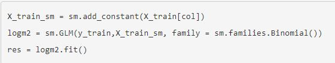

# Logistic Regression

**Logistic regression**, which is a **classification model**, i.e. it will help you make predictions in cases where the output is a **categorical variable**. Since logistic regression is the most easily interpretable of all classification models, it is very commonly used in various industries such as banking, healthcare, etc.

## Introduction: Univariate Logistic Regression
In this session, you will learn a few basic concepts related to logistic regression. Broadly speaking, the topics that will be covered in this session are:

* Binary classification
* Sigmoid function
* Likelihood function
* Building a logistic regression model in Python
* Odds and log odds

## Binary Classification
The most common use of logistic regression models is in binary classification problems.

#### Examples of Classification
1. Finance company wants to know whether a customer is default or not.
2. Predicting an email is spam or not.
3. Categorizing email into promotional, personal and official.

A classification problem where we have two possible outputs/outcomes is called as **Binary Classification problem.**
* Examples
    1. Customer default or not.
    2. Spam/ham example.
    3. Categorizing email into promotional, personal and official. This is not a binary classification problem but a multi class classification problem.

[Diabetes Data](dataset/DiabetesExampleData.csv)

Now, recall the graph of the diabetes example. Suppose there is another person, with a blood sugar level of 195, and you do not know whether that person has diabetes or not. What would you do then? Would you classify him/her as a diabetic or as a non-diabetic?

Now, based on the boundary, you may be tempted to declare this person a diabetic, but can you really do that? This person’s sugar level (195 mg/dL) is very close to the threshold (200 mg/dL), below which people are declared as non-diabetic. It is, therefore, quite possible that this person was just a non-diabetic with a slightly high blood sugar level. After all, the data does have people with slightly high sugar levels (220 mg/dL), who are not diabetics.

## Sigmoid Curve
In the last section, you saw what a binary classification problem is, and then you saw an example of a binary classification problem, where a model is trying to predict whether a person has diabetes or not based on his/her blood sugar level. We saw how using a **simple boundary decision method** would not work in this case.

Since the **sigmoid curve** has all the properties you would want — extremely low values in the start, extremely high values in the end, and intermediate values in the middle — it’s a good choice for modelling the value of the **probability of diabetes.**

This is the sigmoid curve equation:

So now we have verified, with actual values, that the sigmoid curve actually has the properties we discussed earlier, i.e. extremely low values in the start, extremely high values in the end, and intermediate values in the middle.

However, you may be wondering — why can’t you just fit a straight line here? This would also have the same properties — low values in the start, high ones towards the end, and intermediate ones in the middle.

The main problem with a straight line is that it is not steep enough. In the sigmoid curve, as you can see, you have low values for a lot of points, then the values rise all of a sudden, after which you have a lot of high values. In a straight line though, the values rise from low to high very uniformly, and hence, the “boundary” region, the one where the probabilities transition from high to low is not present.

## Finding the Best Fit Sigmoid Curve - I

So, in the previous lecture, you saw what a sigmoid function is and why it is a good choice for modelling the probability of a class. Now, in this section, you will learn how you can find the best fit sigmoid curve. In other words, you will learn how to find the combination of β0 and β1 which fits the data best.

By varying the values of β0 and β1, we get different sigmoid curves. Now, based on some function that you have to minimise or maximise, you will get the best fit sigmoid curve.

So, the best fitting combination of β0 and β1 will be the one which maximises the product:

## Finding the Best Fit Sigmoid Curve - II
In the previous lecture, you understood what a likelihood function is. To recap, the likelihood function for our data is **(1-P1)(1-P2)(1-P3)(1-P4)(1-P6)(P5)(P7)(P8)(P9)(P10) .** The best fitting sigmoid curve would be the one which maximises the value of this product.

If you had to find β0 and β1 for the best fitting sigmoid curve, you would have to try a lot of combinations, unless you arrive at the one which maximises the likelihood. This is similar to linear regression, where you vary β0 and β1 until you find the combination that minimises the cost function. 
This process, where you vary the betas until you find the best fit curve for the probability of diabetes, is called **logistic regression.**

## Odds and Log Odds
In the previous segment, you saw that by trying different values of β0 and β1 , you can manipulate the shape of the sigmoid curve. At some combination of β0 and β1, the 'likelihood' will be maximised.

###  Logistic Regression in Python
Let's now look at how logistic regression is implemented in python.In python, logistic regression can be implemented using libraries such as SKLearn and statsmodels, though looking at the coefficients and the model summary is easier using statsmodels. 

You can find the optimum values of β0 and β1 using the python code given below. Please download and run the code and observe the values of the coefficients.

Please note that you will study a detailed Python code for logistic regression in the next module. This Python code has been run so as to find the optimum values of β0 and β1 so that we can first proceed with the very important concept of **Odds and Log Odds**.

[Finding Optimum Betas using Python](dataset/Betas+for+Logistic+Regression.ipynb)

The summary of the model is given below:

In the summary shown above, 'const' corresponds to β0 and Blood Sugar Level, i.e. 'x1' corresponds to β1. So, β0 = -13.5 and β1 = 0.06.

### Odds and Log Odds
So far, you’ve seen this equation for logistic regression:

Recall that this equation gives the relationship between P, the probability of diabetes and x, the patient’s blood sugar level.

While the equation is correct, it is not very intuitive. In other words, the relationship between P and x is so complex that it is difficult to understand what kind of trend exists between the two. If you increase x by regular intervals of, say, 11.5, how will that affect the probability? Will it also increase by some regular interval? If not, what will happen?

So, clearly, the relationship between P and x is too complex to see any apparent trends. However, if you convert the equation to a slightly different form, you can achieve a much more intuitive relationship. 

[Note: By default, for this course, if the base of the logarithm is not specified, take it as e. So, log(x) = loge(x)]

So, now, instead of probability, you have odds and log odds. Clearly, the relationship between them and x is much more intuitive and easy to understand.

So, the relationship between x and probability is not intuitive, while that between x and **odds/log odds** is. This has important implications. Suppose you are discussing sugar levels and the probability they correspond to. While talking about 4 patients with sugar levels of 180, 200, 220 and 240, you will not be able to intuitively understand the relationship between their probabilities (10%, 28%, 58%, 83%). However, if you are talking about the log odds of these 4 patients, you know that their log odds are in a **linearly increasing pattern** (-2.18, -0.92, 0.34, 1.60) and that the odds are in a **multiplicatively increasing pattern** (0.11, 0.40, 1.40, 4.95, increasing by a factor of 3.55).

Hence, many times, it makes more sense to present a logistic regression model’s results in terms of log odds or odds than to talk in terms of probability. This happens especially a lot in industries like finance, banking, etc.

That's the end of this session on univariate logistic regression. You studied logistic regression, specifically, the sigmoid function, which has this equation:

However, this is not the only form of equation for logistic regression. There is also the probit form and cloglog form of logistic regression.

## Multivariate Logistic Regression - Model Building

### Introduction
Just like when you’re building a model using linear regression, one independent variable might not be enough to capture all the uncertainties of the target variable in logistic regression as well. So in order to make good and accurate predictions, you need multiple variables and that is what we’ll study in this session.

Before starting with multivariate logistic regression, the first question that arises is, “Do you need any extensions while moving from univariate to multivariate logistic regression?” Recall the equation used in the case of univariate logistic regression was:

The above equation has only one feature variable X, for which the coefficient is β1. Now, if you have multiple features, say n, you can simply extend this equation with ‘n’ feature variables and ‘n’ corresponding coefficients such that the equation now becomes:

Recall this extension is similar to what you did while moving from simple to multiple linear regression.

## Multivariate Logistic Regression - Telecom Churn Example
Let's now look at the process of building a logistic regression model in Python.

You will be looking at the telecom churn prediction example. You will use 21 variables related to customer behaviour (such as the monthly bill, internet usage etc.) to predict whether a particular customer will switch to another telecom provider or not (i.e. churn or not).

#### Problem Statment
You have a telecom firm which has collected data of all its customers. The main types of attributes are:
* Demographics (age, gender etc.)
* Services availed (internet packs purchased, special offers taken etc.)
* Expenses (amount of recharge done per month etc.)

Based on all this past information, you want to build a model which will predict whether a particular customer will churn or not, i.e. whether they will switch to a different service provider or not. So the variable of interest, i.e. the target variable here is ‘Churn’ which will tell us whether or not a particular customer has churned. It is a binary variable - 1 means that the customer has churned and 0 means the customer has not churned.

You can download the datasets here:

[Churn Data](dataset/churn_data.csv)

[Internet Data](dataset/internet_data.csv)

[Customer Data](dataset/customer_data.csv)

Also, here’s the data dictionary:

[Telecom Churn Data Dictionary](dataset/TelecomChurnDataDictionary.csv)

You can also download the code file and may follow along. 

[Logistic Regression Telecom Churn Case Study](dataset/Logistic+Regression+-+Telecom+Churn+Case+Study.ipynb)

So, here’s what the data frame churn_data looks like:

Also, here’s the data frame customer_data:

Lastly, here’s the data frame internet_data:

Now, as you can clearly see, the first 5 customer IDs are exactly the same for each of these data frames. Hence, using the column customer ID, you can collate or merge the data into a single data frame. We'll start with that in the next segment.

## Data Cleaning and Preparation - I
Before you jump into the actual model building, you first need to clean and prepare your data. As you might have seen in the last segment, all the useful information is present in three dataframes with ‘Customer ID’ being the common column. So as the first step, you need to merge these three data files so that you have all the useful data combined into a single master dataframe. 

Now that you have the master dataframe in place, and you have also performed a binary mapping for few of the categorical variables, the next step would be to create dummy variables for features with multiple levels. The dummy variable creation process is similar to what you did in linear regression as well. 

So the process of dummy variable creation was quite familiar, except this time, you manually dropped one of the columns for many dummy variables. For example, for the column ‘MultipleLines’, you dropped the level ‘MultipleLines_No phone service’ manually instead of simply using ‘drop_first = True’ which would’ve dropped the first level present in the ‘MultipleLines’ column. The reason we did this is that if you check the variables ‘MultipleLines’ using the following command, you can see that it has the following three levels:

Now, out of these levels, it is best that you drop ‘No phone service’ since it isn’t of any use because it is anyway being indicated by the variable ‘PhoneService’ already present in the dataframe.

To simply put it, the variable **‘PhoneService’** already tells you whether the phone services are availed or not by a particular customer. In fact, if you check the value counts of the variable 'PhoneService', following is the output that you get:

You can see that the dummy variable for this level, i.e. 'MultipleLines_No phone service' is clearly redundant since it doesn't contain any extra information and hence, to drop it is the best option at this point. You can verify it similarly for all the other categorical variables for which one of the levels was manually dropped.

### Data Cleaning and Preparation - II
You’ve merged your dataframes and handled the categorical variables present in them. But you still need to check the data for any outliers or missing values and treat them accordingly. Let's get this done as well.

You saw that one of the columns, i.e. 'TotalCharges' had 11 missing values. Since this isn't a big number compared to the number of rows present in a dataset, we decided to drop them since we won't lose much data.

Now that you have completely prepared your data, you can start with the preprocessing steps. As you might remember from the previous module, you first need to split the data into train and test sets and then rescale the features. So let’s start with that.

We scaled the variables to standardise the three continuous variables — tenure, monthly charges and total charges. Recall that scaling basically reduces the values in a column to within a certain range — in this case, we have converted the values to the Z-scores.

### Churn Rate and Class Imbalance

Another thing to note here was the Churn Rate. You saw that the data has almost 27% churn rate. Checking the churn rate is important since you usually want your data to have a balance between the 0s and 1s (in this case churn and not-churn). 

The reason for having a balance is simple. Let’s do a simple thought experiment - if you had a data with, say, 95% not-churn (0) and just 5% churn (1), then even if you predict everything as 0, you would still get a model which is 95% accurate (though it is, of course, a bad model). This problem is called **class-imbalance** and you'll learn to solve such cases later.

Fortunately, in this case, we have about 27% churn rate. This is neither exactly 'balanced' (which a 50-50 ratio would be called) nor heavily imbalanced. So we'll not have to do any special treatment for this dataset.

## Building your First Model
Let’s now proceed to model building. Recall that the first step in model building is to check the correlations between features to get an idea about how the different independent variables are correlated. In general, the process of feature selection is almost exactly analogous to linear regression.

Looking at the correlations certainly did help, as you identified a lot of features beforehand which wouldn’t have been useful for model building. We can drop the following features after looking at the correlations from the heatmap:
* MultipleLines_No
* OnlineSecurity_No
* OnlineBackup_No
* DeviceProtection_No
* TechSupport_No
* StreamingTV_No
* StreamingMovies_No

If you look at the correlations between these dummy variables with their complimentary dummy variables, i.e. ‘MultipleLines_No’ with ‘MultipleLines_Yes’ or ‘OnlineSecurity_No’ with ‘OnlineSecurity_Yes’, you’ll find out they’re highly correlated. Have a look at the heat map below:

If you check the highlighted portion, you’ll see that there are high correlations among the pairs of dummy variables which were created for the same column. For example, **‘StreamingTV_No’** has a correlation of **-0.64** with **‘StreamingTV_Yes’**. So it is better than we drop one of these variables from each pair as they won’t add much value to the model. The choice of which of these pair of variables you desire to drop is completely up to you; we’ve chosen to drop all the 'Nos' because the 'Yeses' are generally more interpretable and easy-to-work-with variables.

Now that you have completed all the pre-processing steps, inspected the correlation values and have eliminated a few variables, it’s time to build our first model. 

So you finally built your first multivariate logistic regression model using all the features present in the dataset. This is the summary output for different variables that you got:

In this table, our key focus area is just the different **coefficients** and their respective **p-values**. As you can see, there are many variables whose p-values are high, implying that that variable is statistically insignificant. So we need to eliminate some of the variables in order to build a better model.

We'll first eliminate a few features using Recursive Feature Elimination (RFE), and once we have reached a small set of variables to work with, we can then use manual feature elimination (i.e. manually eliminating features based on observing the p-values and VIFs).

### Feature Elimination using RFE
You built your first model in the previous segment. Based on the summary statistics, you inferred that many of the variables might be insignificant and hence, you need to do some feature elimination. Since the number of features is huge, let's first start off with an automated feature selection technique (RFE) and then move to manual feature elimination (using p-values and VIFs) - this is exactly the same process that you did in linear regression.

So let's start off with the automatic feature selection technique - RFE.

Let's see the steps you just performed one by one. First, you imported the logistic regression library from sklearn and created a logistic regression object using:

Then you run an RFE on the dataset using the same command as you did in linear regression. In this case, we choose to select 15 features first (15 is, of course, an arbitrary number).

RFE selected 15 features for you and following is the output you got:

You can see that RFE has eliminated certain features such as 'MonthlyCharges', 'Partner', 'Dependents', etc.    

We decided to go ahead with this model but since we are also interested in the statistics, we take the columns selected by RFE and use them to build a model using statsmodels using:

Here, you use the **GLM (Generalized Linear Models)** method of the library statsmodels. **'Binomial()'** in the 'family' argument tells statsmodels that it needs to fit **a logit curve to a binomial data** (i.e. in which the target will have just two classes, here 'Churn' and 'Non-Churn').

Now, recall that the logistic regression curve gives you the **probabilities of churning and not churning**. You can get these probabilities by simply using the **'predict'** function as shown in the notebook.

Since the logistic curve gives you just the probabilities and not the actual classification of **'Churn'** and **'Non-Churn'**, you need to find a **threshold probability** to classify customers as 'churn' and 'non-churn'. Here, we choose 0.5 as an arbitrary cutoff wherein if the probability of a particular customer churning is less than 0.5, you'd classify it as **'Non-Churn'** and if it's greater than 0.5, you'd classify it as **'Churn'. The choice of 0.5 is completely arbitrary at this stage** and you'll learn how to find the optimal cutoff in 'Model Evaluation', but for now, we'll move forward with 0.5 as the cutoff.

### Confusion Matrix and Accuracy
You chose a cutoff of 0.5 in order to classify the customers into 'Churn' and 'Non-Churn'. Now, since you're classifying the customers into two classes, you'll obviously have some errors. The classes of errors that would be there are:
* 'Churn' customers being (incorrectly) classified as 'Non-Churn'
* 'Non-Churn' customers being (incorrectly) classified as 'Churn'

To capture these errors, and to evaluate how well the model is, you'll use something known as the **'Confusion Matrix'**. A typical confusion matrix would look like the following:

This table shows a comparison of the predicted and actual labels. The actual labels are along the vertical axis, while the predicted labels are along the horizontal axis. Thus, the second row and first column (263) is the number of customers who have actually ‘churned’ but the model has predicted them as non-churn.

Similarly, the cell at second row, the second column (298) is the number of customers who are actually ‘churn’ and also predicted as ‘churn’.

Note that this is an example table and not what you'll get in Python for the model you've built so far. It is just used an example to illustrate the concept.

Now, the simplest model evaluation metric for classification models is accuracy - it is the percentage of correctly predicted labels. So what would the correctly predicted labels be? They would be:
* 'Churn' customers being actually identified as churn
* 'Non-churn' customers being actually identified as non-churn.

As you can see from the table above, the correctly predicted labels are contained in the first row and first column, and the last row and last column as can be seen highlighted in the table below:

Now, accuracy is defined as:

Hence, using the table, we can say that the accuracy for this table would be:

Now that you know about confusion matrix and accuracy, let's see how good is your model built so far based on the accuracy. 

So using the confusion matrix, you got an accuracy of about 80.8% which seems to be a good number to begin with. The steps you need to calculate accuracy are:
* Create the confusion matrix
* Calculate the accuracy by applying the 'accuracy_score' function to the above matrix

### Manual Feature Elimination

Recall that you had used RFE to select 15 features. But as you saw in the pairwise correlations, there are high values of correlations present between the 15 features, i.e. there is still some multicollinearity among the features. So you definitely need to check the VIFs as well to further eliminate the redundant variables. Recall that VIF  calculates how well one independent variable is explained by all the other independent variables combined. And its formula is given as:

where 'i' refers to the ith variable which is being represented as a combination of rest of the independent variables.

To summarise, you basically performed an iterative manual feature elimination using the VIFs and p-values repeatedly. You also kept on checking the value of accuracy to make sure that dropping a particular feature doesn't affect the accuracy much. 

This was the set of 15 features that RFE had selected which we began with:

And this is the final set of features which you arrived at after eliminating features manually:

As you can see, we had dropped the features 'PhoneService' and 'TotalCharges' as a part of manual feature elimination.
Now that we have a final model, we can begin with model evaluation and making predictions.

## Multivariate Logistic Regression - Model Evaluation
In this session, you will first learn about a few more metrics beyond accuracy that are essential to evaluate the performance of a logistic regression model. Then based on these metrics, you'll learn how to find out the optimal scenario where the model will perform the best. The metrics that you'll learn about are:
* Accuracy
* Sensitivity, specificity and the ROC curve
* Precision and Recall
Finally, once you've chosen the optimal scenario based on the evaluation metrics, we'll finally go on and make predictions on the test dataset and see how your model performs there as well.

